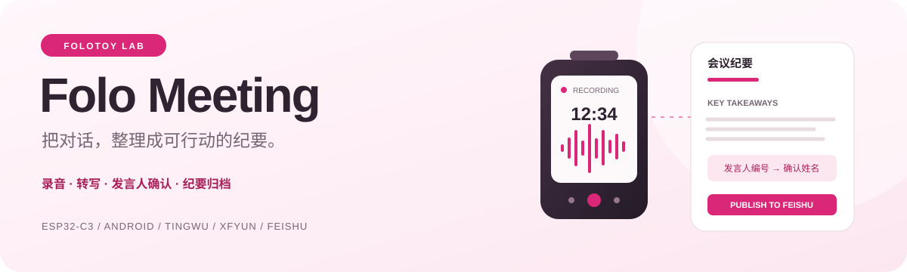
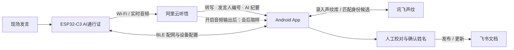

<div align="center">



# FoloToy 会议

**一张随身AI通行证，一个 Android App，把现场对话整理成可编辑、可归档的会议纪要。**

ESP32-C3 · Android 8+ · 乐鑫 BLE 配网 · 阿里云听悟 · 讯飞声纹 · 飞书文档

[下载安装](https://github.com/1ikeMcFlurry/folo-meeting/releases) · [快速开始](#快速开始) · [声纹识别](#声纹识别怎么用) · [源码构建](doc/meeting/BUILD.md) · [发布说明](doc/meeting/RELEASING.md)

</div>

---

## 这个项目做什么

Folo Meeting 将 **AI通行证固件、Android App、协议实现和构建工具** 放在一个仓库中，配套发布和追踪版本。AI通行证通过 Wi-Fi 直接向听悟发送声音；会后在手机上获取转写和 AI 纪要，确认发言人姓名、编辑内容，再发布到自己的飞书账号。

当前为 **v0.1.1 试用版**，已经完成短录音、配网、会后声纹候选和纪要编辑的真机验证。长会议稳定性、多人声纹准确率仍需继续验证，已知限制见本文后半部分。

| 能力 | 当前实现 |
| --- | --- |
| 独立录音 | ESP32-C3 + ES8311 麦克风，设备确定键开始 / 结束，Wi-Fi 直传听悟 |
| BLE 配网 | 乐鑫官方配网组件，扫描设备附近的 2.4 GHz Wi-Fi，分步显示连接结果 |
| 发言人区分与 AI 纪要 | 听悟区分本场不同发言人，输出编号、转写、纪要与待办 |
| 会后编辑 | 云端原稿与手机编辑稿分开保存，可调整标题、纪要、逐字稿和本场姓名 |
| 声纹库与身份匹配 | 讯飞管理已录入的声纹；会后将发言片段与声纹库匹配，由用户确认姓名候选 |
| 飞书归档 | 预览、创建与更新文档，写入后回读验证；并发修改时停止覆盖 |
| 配套发布 | 同一版本下提供 APK、ESP32-C3 应用固件和 SHA-256 校验 |

## 目前接入的两家语音服务

**现阶段先对接阿里云听悟和讯飞声纹这两家服务，共同完成发言人区分、纪要生成和声纹身份匹配。** 其他语音服务的接入可在后续单独评估。

| 服务 | 当前负责什么 | 你会看到什么 |
| --- | --- | --- |
| **阿里云听悟** | 语音转写、区分一场会议中的不同发言人、生成 AI 纪要与待办 | “发言人 1、发言人 2……”及各自的发言内容；这些编号属于本场会议 |
| **讯飞声纹识别（新版）** | 创建声纹库、录入和管理声纹、将会议中的声音片段与已录入声纹匹配 | 对应已登记人员的姓名候选，由用户核对后应用 |

例如，**听悟已经能把两个人的发言分开，标为“发言人 1”和“发言人 2”**。要进一步对应到“张三”和“李四”，当前方案需要先在讯飞录入他们的声纹，再用本场声音片段匹配声纹库。App 根据匹配结果显示姓名候选，确认后写入本场编辑稿。

因此，不配置讯飞也能通过听悟区分不同发言人、生成纪要，并在 App 手动改名；需要使用已登记的声纹匹配身份时，再配置讯飞。声纹注册和会后匹配是独立步骤，不会在录入声纹后直接改写所有会议。

这里的“两家”指当前接入的语音与 AI 处理服务。**飞书**是可选的文档归档目标，**乐鑫 BLE 配网**负责 AI通行证连接 Wi-Fi。

## 系统如何协作



**听悟先区分“谁在说哪一段”，讯飞再与声纹库匹配“可能是哪位已登记的人”，App 经用户确认后应用姓名。** 发布飞书是可选步骤，会议编辑稿也可以保存在手机。

这条主流程没有自建业务服务器。设备与手机分别访问用户配置的云服务账号；录音期间蓝牙会关闭，以给 Wi-Fi 和音频处理留出资源。

## 下载安装

打开 [Releases](https://github.com/1ikeMcFlurry/folo-meeting/releases)，选择同一版本的安装文件：

| 文件 | 用途 |
| --- | --- |
| `folo-meeting-v0.1.1-android.apk` | 安装到 Android 8.0 及以上手机 |
| `folo-meeting-v0.1.1-esp32c3-app.bin` | 已有兼容分区布局的 **8 MB ESP32-C3 工牌**应用升级包 |
| `SHA256SUMS.txt` | 下载后的 SHA-256 校验值 |
| `release-manifest.json` | 源码提交、版本、构建信息、文件大小与哈希 |

> **固件只写入应用分区 `0x10000`。** 本版不是空白芯片的完整出厂镜像，也不适用于任意 ESP32 开发板。不要擦除整片 Flash；设备身份、网络配置和会议记录需要保留。具体操作见 [安装与烧录](doc/meeting/INSTALL.md)。

APK 是当前试用签名的测试分发包，已关闭可调试标记并启用 R8；尚未配置商店正式发行签名。与现有测试手机上的同签名版本可以覆盖安装。自行构建时若使用了不同签名，无法直接覆盖已有安装，详见构建说明。

## 快速开始

### 1. 准备设备和账号

| 需要准备 | 说明 |
| --- | --- |
| 兼容AI通行证 | ESP32-C3、8 MB Flash、ST7789P3 屏幕、ES8311 音频、ADC 三键；[引脚定义](components/platform/platform_esp32/include/platform/board_config.h) |
| Android 手机 | Android 8.0+、BLE、可访问云服务的网络 |
| Wi-Fi | AI通行证可连接的 2.4 GHz 网络，设备需要独立访问互联网 |
| 听悟账号 | 已开通听悟服务，并准备 AccessKey ID、AccessKey Secret、听悟 AppKey |
| 讯飞账号（可选） | 单独开通「声纹识别（新版）」，准备 AppID、APISecret、APIKey |
| 飞书应用（可选） | 自建应用及对应文档 / 云空间权限，按 App 引导授权 |

听悟、讯飞的试用额度分别管理。音频输出、AI 处理和声纹请求可能消耗试用或付费额度，实际权益、有效期、账单以各自控制台为准；App 暂不显示剩余额度。

### 2. 连接AI通行证并配网

1. 安装并打开 **FoloToy 会议**，允许附近设备权限。Android 11 及以下还需位置权限以扫描 BLE。
2. 长按AI通行证 **上键** 开启蓝牙，在 App「设备」页点击 **搜索附近设备**，选择 `Folo-Meeting-xxxx`。
3. 首次连接时，在系统配对提示中输入设备屏幕显示的六位码。
4. 点击 **配置 Wi-Fi**，选择AI通行证扫描到的网络，输入密码。也可以手动添加隐藏网络。
5. 等待连接路由器、获取 IP 和保存确认全部完成。手机可以继续使用原来的网络。

配网采用乐鑫官方 BLE Provisioning / Security 1；随机 PoP 通过已认证的设备控制连接取得。密码错误可以在向导内重试；取消或超时会恢复设备最后确认的网络配置。配网页面会保持亮屏，退出后恢复正常。

### 3. 配置听悟并发送到设备

打开 **设置 → 听悟服务**，填写自己的三项凭证并保存。再打开 **设置 → 录音偏好**，设置默认标题、录音上限和发布方式。

首次试用建议将录音上限设为 **1 分钟**，发布方式选 **手机确认后发布**。需要声纹识别时，提前开启 **会后声纹识别用音频**。

保持设备连接，点击 **保存并发送给AI通行证**；也可以回到「设备」页点击 **发送设置给AI通行证**。App 保存成功只代表手机有配置，必须发送并核对设备状态后，AI通行证才会使用这些设置。

### 4. 录制第一场会议

1. 按AI通行证 **确定键** 开始录音，也可在 App 设备页发起。
2. 等待设备进入录音状态，先录一场约 30–60 秒的清晰发言。
3. 再按 **确定键** 结束，等待上传和云端处理。
4. 会后重新连接设备，点击 **同步会议记录**。
5. 打开 **记录 → 选择会议 → 获取最终纪要**。

进入编辑页后，可以分别修改会议标题、纪要与待办、发言人姓名和逐字稿。**保存编辑稿** 仅保存手机上的修改；获取云端原稿、识别发言人和发布文档是独立操作。

### 5. 发布到飞书

在 **设置 → 飞书连接** 填写应用信息，点击 **授权手机访问飞书**，按页面完成用户授权。目标文件夹 Token 可以留空。

回到会议编辑页，先 **预览飞书排版**，再 **生成飞书文档**。已经发布的会议会显示 **更新这份飞书文档**，便于后续校对同一份文档。

发布内容包含会议基本信息、纪要与待办、逐字稿；支持章节层级、发言人标注和可对应的时间段。手机保留的正文修订会参与导出；不为了补齐内容而恢复已经清空的编辑稿。

设备自动保存需要额外点击 **授权AI通行证自动保存**，两端授权独立。要先确认声纹姓名再发布，请使用「手机确认后发布」流程。

## 声纹识别怎么用

### 先录入，再识别某一场会议

1. 打开 **设置 → 声纹管理 → 讯飞声纹设置**，填写「声纹识别（新版）」凭证。
2. **检查连接和账号 → 准备声纹库**。
3. 填写姓名或称呼，由本人在安静环境连续说话约 5 秒，按页面操作上传录入。
4. 在录音前开启 **录音偏好 → 会后声纹识别用音频**，并发送给设备。这个开关默认关闭，只影响之后创建的新会议。
5. 会议中尽量让每人有至少 12 秒清晰、连续、无其他人插话的发言。
6. 会后获取最终纪要，点击 **识别本场发言人 → 取样并识别**。
7. 核对候选，逐项勾选确实无误的姓名，再点击 **应用已勾选姓名**。

> **听悟本身就能区分不同发言人，但当前接入流程输出的是本场编号，不是声纹库中的具体人员身份。** 将“发言人 1、2、3”对应到已登记人员，需要 App 取样、调用讯飞声纹库匹配，再由用户确认。已手动命名的发言人会保留原名。

### 候选分数如何理解

| 情况 | App 行为 |
| --- | --- |
| 两段声音指向同一声纹，均达到 0.75 | 显示标准候选，还需人工勾选 |
| 只有一段有效声音，达到 0.85 | 显示标准候选，还需人工勾选 |
| 全部有效片段达到 0.60，但未达到标准门槛 | 显示「低相似度候选」，仅供本人核对 |
| 分数不足、多人相近、片段冲突、声音太短 | 保留编号，不推断姓名 |

所有候选都要求首选与次选有足够差距，**默认不勾选**。这些是试验阈值，分数不是成功率，也不能用来证明身份；多人准确率还没有完成标定。

每位发言人最多取两段独立的 5 秒声音，一次最多处理前 8 位、调用讯飞 16 次。取样避开已标出的多人重叠区间；如果听悟的原始分离有误，仍可能影响匹配。

### 同一个人、不同收音设备匹配较低

可以使用候选区的 **用发言人…的声音补录声纹**，选择本人已注册的姓名并确认。App 将本场第一段 5 秒声音合并进原声纹，再用另一段、未参与补录的声音验证。

补录保留原样本，但这次云端合并不能单独撤销。系统会排除已用于训练的重叠片段，避免用刚补录的声音自我验证；同一段不能重复补录。网络响应不确定时会先核对云端状态。

## 数据存放在哪里

| 数据 | 存放与处理方式 |
| --- | --- |
| 会议实时录音 | 设备固定 RAM 缓冲直接推流，不保存会议音频文件到本地 Flash |
| 云端会议音频 | 开启音频输出后，听悟生成 MP3；保留策略由云服务管理 |
| 会后取样片段 | 手机内存中读取、解码、上传，完成或取消后清空 App 持有的缓冲 |
| 原稿、编辑稿、候选报告 | 手机加密存储；发布后的文档另存于飞书 |
| 声纹特征 | 用户的讯飞账号；姓名与特征的对应关系保存在手机 |
| 服务配置 | 用户在 App 中填写；手机通过 Android Keystore 支持的加密存储保存，AI通行证所需配置写入设备 NVS |

当前 App 没有删除听悟云端录音的 API。关闭音频开关只影响新会议；清空手机音频缓冲、签名地址过期，都不等于云端录音被删除。设备 NVS 不是手机的加密保险箱，本试用固件没有提供经过验证的 Flash 加密 / Secure Boot 量产配置。

## 源码与开发

```text
folo-meeting/
├── companion/android/              # 原生 Java Android App + Gradle Wrapper
│   └── app/src/
│       ├── main/                   # BLE 配网、会议编辑、云服务与声纹
│       ├── test/                   # JVM 单元测试
│       └── androidTest/            # 真机音频解码测试；仅合成音频
├── components/
│   ├── app/                        # 固件入口与设备按键交互
│   ├── core/                       # 硬件端口、纯 C 业务与状态
│   ├── platform/platform_esp32/     # Wi-Fi、BLE、音频、听悟、飞书适配
│   └── ui/presentation/            # LVGL 会议状态页与基础显示
├── tools/meeting_trial/            # 构建、串口诊断与开发验证工具
├── doc/meeting/                    # 安装、构建、发布说明
├── partitions.csv                  # Flash 分区布局
├── dependencies.lock               # ESP-IDF 组件依赖锁定
└── README.badge.md                  # 原工牌固件说明，供底层维护参考
```

开发工具链：**ESP-IDF v5.5.3 / JDK 17 / Gradle 8.13 / Android SDK 36**。Android 最低 API 26，target API 35。

```powershell
# 已在当前终端启用 ESP-IDF Python 环境，并安装构建依赖
python tools/meeting_trial/build_trial.py --companion

# 配置 JAVA_HOME、ANDROID_HOME 后；自动构建 APK、运行单测和 lint
python tools/meeting_trial/build_android.py
```

完整环境准备、输出路径、测试与签名说明见 **[源码构建](doc/meeting/BUILD.md)**。根目录保留工牌基础配置，构建会议固件必须带 `--companion`；直接使用普通工牌构建命令不会生成本项目的会议功能版本。

## 已验证与当前边界

| 项目 | 验证结果 / 边界 |
| --- | --- |
| Android 业务逻辑 | 60 项 JVM 单元测试通过，覆盖候选、草稿保护、导出、取样、声纹恢复等 |
| Android 构建检查 | APK 构建成功，lint 无错误；试用包不可调试，去除敏感 SDK 日志 |
| 真机音频解码 | 合成 48 kHz 双声道 MP3 转 16 kHz 单声道、重复 seek、时间定位、短片段拒绝通过 |
| 真实录音链路 | 19 秒真人实录，采集 / 上传均为 608,000 字节，听悟处理完成并返回音频 |
| 声纹闭环 | 注册、补录、独立片段识别、候选确认、保存后重开与文档预览已验证 |
| BLE 配网 | 官方配网、错误提示、取消 / 重试、成功联网及返回层级经过真机检查 |
| 长会议与多人 | 尚未完成长时间稳定性和多人准确率验收 |
| 断网 | 无本地音频备份，超出固定缓冲承受范围可能中断，不承诺离线补传 |
| 开始录音后重启 | 曾收到一次反馈，后续短录音未复现，根因尚未确认；已补充诊断和失败任务恢复 |
| 设备自动归档 | 有独立授权与实现路径；不要将手机发布验证等同于设备自动归档全部验收 |

## 常见问题

| 现象 | 处理方法 |
| --- | --- |
| 手机搜不到设备 | 长按上键启用 BLE；确认附近设备权限，旧 Android 检查位置权限；录音期间 BLE 关闭属于预期行为 |
| 配网提示密码错误 / 找不到网络 | 在向导中重试，检查网络是 2.4 GHz；隐藏网络可手动添加 |
| 配网成功但会议无法开始 | 获取 IP 不代表听悟可用；检查网络出站访问、服务开通、三项凭证及是否已发送给设备 |
| 只保存了 App 设置，设备仍用旧配置 | 重新连接，点击发送设置，并检查设备回读状态 |
| 云端仍在处理 / 返回 PAUSED | 等待收尾并重新查询；保留错误状态排查，不连续强制重复提交云端结束请求 |
| 已注册声纹，还是发言人编号 | 确认录音前开启音频输出；获取最终纪要后执行识别，再勾选并应用候选 |
| 提示旧会议没有音频 | 无法从纯文字结果补回音频；开启开关后重新录制 |
| 本人识别分数较低 | 改善安静程度与收音距离；必要时本人确认后补录，用独立片段验证，低分不能当成确定身份 |
| 姓名改了，已发飞书文档没变 | 本场编辑稿已更新，校对后点击更新这份飞书文档 |
| 飞书更新被拦截 | 可能被其他人修改；先核对当前版本，避免覆盖对方修改或附件、评论 |
| APK 无法覆盖安装 | 检查包名及签名是否一致；不要直接卸载，避免丢失本地配置、草稿和姓名映射 |

## 文档导航

- **[安装与烧录](doc/meeting/INSTALL.md)**：下载、校验、保留数据升级、硬件兼容与回退。
- **[源码构建](doc/meeting/BUILD.md)**：环境配置、Gradle Wrapper、固件构建、测试入口。
- **[发布流程](doc/meeting/RELEASING.md)**：配套版本、签名、打包、校验和上传。
- [Android 实现入口](companion/android/README.md) · [开发工具索引](tools/meeting_trial/README.md)
- [原固件分层架构](doc/ARCHITECTURE.md) · [原工牌说明](README.badge.md)

## 项目来源

固件基于 [FoloToy/folo-ai-passport-firmware-demo](https://github.com/FoloToy/folo-ai-passport-firmware-demo) 的硬件与分层架构开发，本仓库整理会议录音固件和 Android 配套 App。第三方组件分别遵循其自身许可；本次整理没有为上游代码或依赖重新授予许可。

服务入口：[听悟控制台](https://tingwu.console.aliyun.com/) · [讯飞声纹识别](https://www.xfyun.cn/services/voiceprint-recognition) · [讯飞控制台](https://console.xfyun.cn/) · [飞书开放平台](https://open.feishu.cn/)
