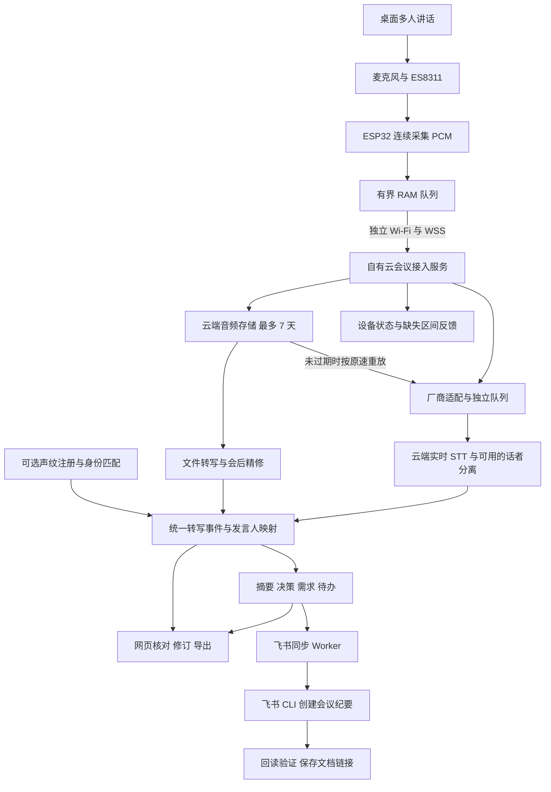

# 独立 Wi-Fi 桌面 AI 会议纪要方案

**最新方向（2026-09-08）：用户希望尽量减少自建云端，默认采用[设备直连方案](D:/folotoy/folo-ai-passport-firmware-demo/doc/specs/2026-09-08-ai-meeting-device-direct.md)。固件直接调用厂商会议 API 与飞书 HTTPS API，不要求运行 CLI 或部署网关。本文的自有网关、云端 CLI Worker 与中心化适配器作为多厂商集中评测／管理的可选架构保留，不再是默认要求。**

核对日期：2026-09-08。状态：架构、开放固件设计与官方服务资料调研完成，尚未接入账号实测。配套文件：[12 家云服务试用清单](D:/folotoy/folo-ai-passport-firmware-demo/doc/ai-meeting-provider-trial-matrix.md)。

**结论与选型方向**

采用“设备采集并上传一次 → 自有云网关 → 可切换的云端 STT／说话人服务 → AI 会议纪要 → 飞书 CLI 创建在线文档”的架构。设备独立连接 Wi-Fi，会议音频仅短暂经过 RAM；测试录音在云端最多保留 7 天，同一份音频可以重复评测各家服务。这里的飞书输出对象是每场实际会议生成的纪要；方案文档的发布不是这项产品能力。

现有 ESP32-C3 + ES8311 可以作为验证起点，但目前固件没有完整会议链路，不能据此认定现有硬件已能稳定完成多人桌面会议。第一阶段先验证持续采音、Wi-Fi + TLS 的内存余量和真实桌面拾音，再决定是否升级主控与麦克风前端。

首轮接入通义听悟、腾讯 ASR V2、讯飞实时转写大模型、火山引擎；随后覆盖百度、华为、Azure、Google、AWS、OpenAI，并补充 Deepgram、AssemblyAI。顺序依据需求匹配和接入便利性制定，属于试验安排，尚无音质或准确率排名。

**1. 已确定的需求与设计边界**

| 项目 | 本方案采用的口径 |
| --- | --- |
| 场景 | 设备放在桌面，采集多人会议；先以普通话、夹杂英文技术词为测试基线 |
| 联网 | 设备独立通过 Wi-Fi 联网；手机可用于首次配网、绑定和查看，会议上传不依赖手机或电脑 |
| 设备存储 | 会议音频不写 Flash、文件系统、SD 卡、日志或崩溃转储；允许有界 RAM 缓冲 |
| 云端录音 | 最多 7 天，用于会后处理、回放核对和多厂商重测 |
| 输出 | 带时间戳的转写、发言人标签、可选人员身份、摘要、决策、需求条目、待办与待确认事项 |
| 会中与会后 | 会中显示临时转写／阶段摘要；会后使用最终转写生成正式草稿，允许人工修订 |
| 飞书输出 | 会后自动创建该场会议的纪要在线文档，回读验证成功后返回链接；会中临时结果不反复新建文档 |
| 断网 | RAM 覆盖不了的音频会丢失，必须标记缺失区间；本方案没有离线补传完整会议的能力 |
| 文本留存 | 用户尚未要求长期保存；试用环境暂按 7 天清理原始转写和派生纪要，主动导出的文档由用户管理 |
| 人数与距离 | 尚无最终指标；先用 2／4／6 人、1／2／3 米测试，结果用于决定产品边界 |

**2. 现有硬件和固件的真实基础**

| 检查结果 | 对方案的影响 | 仓库证据 |
| --- | --- | --- |
| ESP32-C3，单核 160 MHz，无 PSRAM；README 记载可用堆约 50–60 KB | 这是项目记录，并非此次 Wi-Fi 会议运行时测量；必须测量 TLS 握手峰值、最小堆、最大连续块 | [README](D:/folotoy/folo-ai-passport-firmware-demo/README.md:25) |
| ES8311 已有 I2S 读写，当前打开为 16 kHz、16 bit、单声道 | 可复用采样接口；代码没有证明存在可用的多麦阵列 | [音频驱动](D:/folotoy/folo-ai-passport-firmware-demo/components/platform/platform_esp32/src/audio_es8311.c:269) |
| 已有麦克风自检，采用 RAM 录制片段 | 证明音频通路存在；还需要连续采集任务、背压和网络发送 | [音频服务](D:/folotoy/folo-ai-passport-firmware-demo/components/core/services/src/audio_service.c) |
| 已有音效下发和持久化模块 | 它保存的是下行音效；会议上行必须独立实现，不能调用这个落盘通路 | [audio_store](D:/folotoy/folo-ai-passport-firmware-demo/components/platform/platform_esp32/src/audio_store.c) |
| 检索未发现完整 Wi-Fi 初始化、会议 WSS 上传、STT 或纪要业务 | Wi-Fi 编译能力不等于业务已经接通，需要新增网络和会话管理 | 对仓库业务源码的关键词检索 |
| 默认空闲 10 分钟进入深睡 | 录会期间必须持有明确的禁止休眠状态，否则长会中途退出 | [休眠逻辑](D:/folotoy/folo-ai-passport-firmware-demo/components/app/src/app.c:1481) |
| LVGL、BLE、Wi-Fi 与 TLS 共用有限内部 RAM | 会议模式减少动画与显示负荷；BLE 配网后释放资源的方案要单独验证 | [SDK 默认配置](D:/folotoy/folo-ai-passport-firmware-demo/sdkconfig.defaults) |
| 没有找到可用于确认麦克风数量、开孔、指向性和电池实物的完整原理图／BOM | 不能承诺 3 米、6 人、续航小时数；用实机录音和电流测量确定 | 仓库文件清单检查；实物参数待确认 |

设备身份初始化目前与部分 BLE 初始化路径关联。优化 BLE 时先拆开设备身份与无线广播的依赖，避免释放 BLE 同时影响身份读取。量产身份 `cardid` 分区保持原有管理方式；会议 PoC 无需重排分区或擦除身份。

**3. 完整链路**



设备只建立一条主要音频上传连接。云端可以同时转发给几家厂商，也可以从七天内的原始音频重放；比较 12 家不需要设备维持 12 条 TLS 连接。生产时默认只选一家实时服务，会后精修按效果和成本决定是否启用。

STT 厂商不必与纪要大模型属于同一家云。统一文本层使“腾讯转写 + 千问纪要”“讯飞声纹 + 自有纪要”等组合成为可测试选项。跨厂商声纹 ID 不通用，不能直接互传。

**4. 设备端设计**

首版使用单声道 PCM S16LE、16 kHz。每 20 ms 采集 640 字节，或每 40 ms 采集 1,280 字节；设备到自有云选择一种固定分帧。云端再按各家要求聚合，例如腾讯 200 ms、讯飞 40 ms。协议差异由云端处理。来源：[腾讯 V2](https://cloud.tencent.com/document/product/1093/131127)、[讯飞实时大模型](https://www.xfyun.cn/doc/spark/asr_llm/rtasr_llm.html)。

| 计算项 | 结果，不含网络及协议开销 |
| --- | --- |
| PCM 码率 | 16,000 × 16 × 1 = 256 kbit/s |
| 每秒数据 | 32,000 字节 |
| 200 ms RAM 音频 | 6,400 字节，约 6.25 KiB |
| 1 秒 RAM 音频 | 32,000 字节，约 31.25 KiB |
| 1 小时云端 PCM | 115.2 MB，十进制 |
| 每天 10 小时、保留 7 天 | 约 8.064 GB 原始 PCM；另计派生副本和存储元数据 |

200 ms 仅作为第一轮缓冲预算，不代表已经满足 C3 的可用内存或能扛住 200 ms 以上的端到端波动。总预算还包括 I2S DMA、任务栈、Wi-Fi、TCP、TLS、UI 和碎片化余量。首版不增加 Opus 编码；先用无压缩音频减少设备复杂度并统一测试输入。

设备功能拆为连续采集、网络上传、会话状态、界面四部分。采集任务不能等待 UI 或阻塞式网络重试；用固定大小内存池，避免每帧动态分配。设备只接收状态和少量显示文本，整场转写留在云端。

录会期间禁止自动深睡，减少屏幕刷新，停止设备音乐和提示语播放；启动和结束提示应安排在采集窗口之外。没有扬声器同时外放的首版，不把 AEC 作为必选前提；若后续加入会议远端声音或语音助手，需连同播放参考信号一起设计回声消除。多人收音避免开启只保留一个目标声纹的语音过滤，也不采用会截掉远处轻声发言的激进降噪／VAD。

首次配网可复用 BLE 作为入口，但仍需新增 Wi-Fi 参数和绑定协议；绑定后手机可离场。先支持常见家庭／办公室 Wi-Fi，企业 802.1X、网页认证网络另列兼容测试。连接配置可以存储在设备，禁止落盘的对象是会议音频。

**5. 会话协议与异常处理**

以下为自有协议设计，并非某家厂商 API 已提供的保证。

```text
IDLE → CONNECTING → RECORDING → DRAINING → PROCESSING → COMPLETED
                       ↕
                     PAUSED
                       ↕
              NETWORK_INTERRUPTED
```

按键开始后先完成设备鉴权和云端接入准备，再进入正式录制状态。界面区分“连接中”“正在采集并上传”“网络中断”“上传结束、正在处理”。上传可继续而某一家 STT 暂时失败时，显示处理异常，云端依靠已保存音频重试。

每个音频帧至少关联 `meeting_id`、`boot_id`、`seq`、`sample_start`、`sample_count`。音频时间以采样序号为基准，UTC 仅负责映射会议真实时间；暂停和丢帧使用独立事件表达，不靠拼接文本猜测。

云端分别记录“已接收到内存的偏移”与“已经持久化的偏移”。设备不能把 TCP 发送成功当作录音已安全保存，也不能为等待持久化确认无限增长 RAM。若设备已经释放某段 RAM、云端也未持久化，则异常恢复后必须把无法恢复的区间标出来。最终只有持久化确认覆盖的音频才进入完整性统计。

| 异常 | 系统应做的事 |
| --- | --- |
| 短暂 Wi-Fi 波动 | 仅重发 RAM 中仍然保留的数据；云端按会话与采样范围去重 |
| 波动超过 RAM 能力 | 记录起止采样点与丢失时长，提示网络中断；恢复后继续新片段 |
| 设备突然断电 | 已持久化片段保留；未上传音频无法补回；云端超时关闭会话并标记异常结束 |
| 自有云进程失败 | 从耐久记录恢复已保存范围；仍在进程 RAM 的音频不能宣称可恢复 |
| 某一家厂商超时、限流 | 隔离该厂商队列；其失败不阻塞设备上传和其他厂商；从云端录音重试 |
| 厂商实时会话时长到限 | 提前换会话，记录绝对时间偏移；必要时云端加入短重叠并去重，单独计重放费用 |
| 用户暂停较久 | 暂停音频上传并结束／管理厂商会话，按厂商协议恢复；保留真实时间轴，不持续占用付费空连接 |
| 云端音频存储失败 | 立即呈现保存异常；若七天回放为必需，停止宣称正常录制并按策略暂停采集 |

同一场会中不同厂商的 `speaker_0` 没有对应关系；同一厂商重连后的编号也不能默认继承。腾讯 V2 的声纹上下文是有有效期的会话衔接能力，不等于永久人员档案，也不会恢复设备未上传的音频。[腾讯 V2 会话参数](https://cloud.tencent.com/document/product/1093/131127)。

**6. 云端服务划分与数据模型**

PoC 可用一个接入服务、一个任务 Worker、PostgreSQL 和对象存储。接入服务可选团队熟悉的 Go 或 Python 异步框架，AI 使用云 API，无需先租 GPU。需要隔离的重点是各家厂商的超时、队列和限流，初期不必拆成大量微服务。

| 服务 | 负责内容 |
| --- | --- |
| 设备与会话服务 | 设备绑定、短期会话凭证、开会／暂停／结束、在线状态 |
| 音频接入与存储 | WSS、序号校验、流量限制、缺失统计、原始音频持久化、到期清理 |
| 厂商适配器 | 签名、输入分帧、实时／文件 API、结果归一化、错误分类、用量记录 |
| 转写与发言人服务 | 中间结果修订、最终句段、会话内标签、人工姓名映射、可选声纹匹配 |
| 纪要 Worker | 全文／分段摘要、决策、需求、待办，附证据和版本 |
| 飞书同步 Worker | 把已完成的会议纪要转成 Markdown，按会议 ID 创建一次在线文档，回读验证并保存链接 |
| 查看页面 | 转写与音频定位、发言人改名、对比、人工修订、Markdown／JSON 导出 |

适配器显式声明 `stream_asr`、`batch_asr`、`stream_diarization`、`batch_diarization`、`enrolled_identity`、`native_summary`；未知能力标为待验证，调用方不能因“支持说话人”而推断支持实时身份识别。

建议保存 `meeting`、`audio_chunk`、`provider_run`、`utterance`、`speaker_mapping`、`meeting_artifact`、`deletion_job`。每次评测固定音频哈希、输入参数、模型版本、地域、Prompt 版本、运行时间和账单口径。

统一转写事件示例：

```json
{
  "meeting_id": "demo-meeting-001",
  "run_id": "demo-run-001",
  "utterance_id": "u_0007",
  "revision": 2,
  "is_final": true,
  "start_ms": 12000,
  "end_ms": 15700,
  "speaker_label": "spk_02",
  "person_id": null,
  "identity_status": "unconfirmed",
  "text": "负责人还没有定，周五之前再确认。",
  "has_audio_gap": false
}
```

句子更新使用稳定 ID 与 revision，不能把每一次临时结果直接追加为新句。姓名、文本和会议纪要均保留来源关系；人工修订之后生成新版本。

**7. 声纹与说话人：分两级实现**

| 能力 | 例子 | 落地方式 |
| --- | --- | --- |
| 会话内说话人分离 | “发言人 A 说了什么，B 说了什么” | 优先使用 STT 自带标签；无需预录参会人的声音 |
| 已注册人员识别 | “这段是张三说的” | 先登记参考音频／声纹，再匹配；支持未注册人员和不确定状态 |

第一版支持匿名发言人和手工改名，既能产出可用纪要，也能建立标签基准。需要自动实名时，首试讯飞的注册声纹链路；腾讯文件角色认证和 OpenAI 的已知发言人参考作为不同能力单独评估。依据：[讯飞角色分离](https://www.xfyun.cn/doc/spark/asr_llm/rtasr_llm.html)、[腾讯文件转写](https://cloud.tencent.com/document/product/1093/37823)、[OpenAI 文件转写](https://developers.openai.com/api/docs/guides/speech-to-text)。

测试参与者在知晓用途后提供独立注册片段。准备每人 20–30 秒干净声音作为共同源素材，再按厂商规则裁切。注册音频不能从待评测片段中抽取，以免把识别测试变成同一声音片段的匹配。加入未注册来宾，统计把来宾错认成熟人的比例；不凭语言内容、座位、音色直觉或自我介绍自动判定人员身份。

不同服务的置信度不能直接横比。低置信度或分数接近时保留“未确认”；界面允许按整场／片段更正。声纹匹配仅用于会议标注，不承担账号登录或权限授予。测试声纹资源和注册音频一起纳入七天清理；长期声纹库属于后续单独产品设计。

**8. AI 纪要和需求提取**

会中阶段摘要只使用已稳定的转写，每隔一段时间更新并标注“草稿”。会后优先采用完成话者分离和精修的全文，再生成正式草稿。长会按话题分块，保留原始句段 ID 后汇总；不要仅凭上一轮摘要不断递归压缩，否则容易遗失条件和否定。

| 输出 | 必需字段与规则 |
| --- | --- |
| 摘要 | 讨论背景、主要议题、结论；链接对应句段 |
| 决策 | 决策内容、状态、被替代的旧决策、证据 |
| 需求 | 描述、提出人或未知、业务目的、优先级或未知、验收条件或未知、开放问题、证据 |
| 待办 | 动作、明确的负责人或 null、明确的截止日期或 null、状态、证据 |
| 待确认 | 信息冲突、责任未定、相对日期歧义、因音频缺失无法判断的项目 |

“有人提议”不能自动写成“已决定”；“周五前确认负责人”不能改成“负责人周五交付”。所有负责人和日期都要有直接依据。相对日期转换必须结合会议日期和时区，并保留原话；仍不明确则留空。

纪要模型先固定一个，例如百炼千问，以隔离 ASR 差异。再用同一份人工校正转写对比千问、豆包、混元；若有可用账号和部署地域，加入 OpenAI、Gemini。通义听悟自带纪要另作为整套服务评估。入口：[千问 API](https://help.aliyun.com/zh/model-studio/qwen-api-reference)、[火山方舟](https://www.volcengine.com/product/ark)、[混元接入与迁移说明](https://cloud.tencent.com/document/product/1729/111007)。

**9. 七天留存如何落实**

统一设定会议 `expires_at = first_audio_received_at + 168 小时`。重放、转码、上传另一厂商或重新生成纪要，均不得重置这个截止时间；先录制的注册音频使用自己的更早截止时间。

| 位置 | 处理方式 |
| --- | --- |
| 设备 | 仅 RAM，避免采音路径调用文件写入；关闭可能包含音频内存的持久化转储 |
| 自有云对象存储 | 私有桶，原始分片、整场合并文件、转码副本统一到期；到期先拒绝读取和新建处理任务，再执行删除 |
| 清理执行 | 定时删除任务配合生命周期兜底；记录执行时间和失败重试，验证对象不存在。生命周期通常异步执行，不能仅靠“设为 7 天”就声称精确删除 |
| 其他音频副本 | 清理未完成分片上传、对象历史版本、Worker 临时文件、缓存、任务重试队列；不进入长期备份 |
| 第三方厂商 | 每家记录服务端留存、训练使用开关、删除接口、任务结果有效期；我们的桶设置不能保证厂商同步删除 |
| 测试声纹 | 记录注册 ID 和删除方式，到期撤销／删除；不能把七天录音许可延伸为永久声纹库 |
| 转写与纪要 | 试用按七天清理；保留的评测汇总尽量只含分数、耗时、费用和匿名错误类别 |

设备使用自有服务的设备级认证，云厂商密钥仅放云端密钥管理。启用 WSS 证书校验和时间同步，不在设备放共享厂商主密钥。对象下载使用短期签名 URL，有效期受 `expires_at` 限制；网页回放禁用应用离线缓存，不主动下载录音到测试电脑。

厂商处理数据的服务政策需要在正式实测前逐项记录。如果某家不能满足七天上限，仅使用没有敏感内容、另行允许该服务处理的合成／公开测试素材；这部分结果单独标记，不能谎称满足同源私人会议对比。

**10. 公平测试方法和验收**

设备采集一次，云端保存一份规范 PCM／无损文件，记录哈希。所有厂商使用这份波形；必须转换的格式在云端转换并记录。第一轮默认参数和统一语种，第二轮使用同一组专业热词，不把某一家手工深度调优结果与其他默认结果直接比较。

| 试验组 | 输入方式 | 比较什么 |
| --- | --- | --- |
| 实时组 | 云端按 1 倍速重放，遵守各家实时分帧 | 文字准确率、临时／最终结果延迟、实时话者标签、断线衔接 |
| 文件组 | 同一完整录音提交文件 API | 最终准确率、会后话者分离、完成耗时 |
| 已注册人员组 | 独立参考声音 + 已注册与未注册人混合会议 | 实名命中、未知人员保留、错误归人 |
| 纪要组 | 同一份人工校正的转写与同一 Prompt | 决策、需求、待办的正确性、完整性和证据 |
| 整套服务组 | 原始音频到最终纪要 | 真实端到端质量、人工修订时间和总费用 |

基础语料建议六段、每段约五分钟，总计三十分钟：安静双人；四人围桌；六人远场；空调噪声与混响；抢话、短回应和来宾加入；技术词、数字、否定、需求变更与责任未定。保留每个人的参考身份和人工校正文稿，重叠讲话单独标注。

每家实时和文件各跑半小时，12 家最多约 12 个服务小时作为基础量级估算；没有对应模式的标 N/A。一个厂商多测模型、重试、声纹调用、额外纪要均另外计入。实时接口按原速回放，全部厂商可以分批并行，不要求用户重复开 12 场会。

入围后进行真实 2 小时会议连续测试，注入 0.2／3／30 秒断网、厂商 429、云端重启、70 秒暂停、会议超时切段；记录完整性、堆内存、重连、绝对时间戳和发言人变化。用断电后检查设备文件写入／持久化路径验证无音频落盘。

| 指标 | 统计方法与初始目标 |
| --- | --- |
| 中文 CER／英文 WER | 统一数字与标点规则；分别记录原文与规范化结果。建议安静 CER ≤ 10%，困难场景 ≤ 25%，仅为待验证门槛 |
| 说话人 | 同场最佳标签映射后算时长归属；条件具备时报告 DER、是否排除重叠及边界容差。实时标签与最终标签分别算 |
| 实名 | 正确认人率、未知人员被错认率、需要人工修订次数，不把匿名标签准确率充当实名准确率 |
| 延迟 | 句尾到稳定转写、句尾到稳定发言人标签的 P50／P95 分开记录；实时转写 P95 ≤ 3 秒作为首轮体验目标 |
| 纪要 | 关键决策／需求召回、无依据条目、错误负责人／日期、引用对应率。测试集关键决定、负责人和日期不得出现无依据编造 |
| 稳定性 | 2 小时不重启、不持续泄漏；音频缺失可定位，费用和会话可正常结束 |
| 不落盘／过期 | 设备采音无持久化写入；云端到期不可访问，并可验证删除和厂商资源处理结果 |

这些是本项目的验收建议，不是任何厂商的实测成绩或承诺。没有数据前不指定“识别最准”的供应商。

**11. 成本与实施顺序**

完整小时成本 = 实时 STT + 可选文件精修 + 话者／身份附加项 + 纪要模型 + 存储与请求 + 跨云流量 + 重放重试。只比较 ASR 单价会遗漏实际花费。

阿里听悟新版公开价为转写 0.6 元／音频小时，包含说话人分离；多数大模型功能各按 0.064 元／音频小时累加。若使用转写、全文摘要、待办、章节三项大模型功能，示例为 0.792 元／音频小时，未含自有云和重复转写成本。旧版接口价格明显不同，接入时核对新版。[听悟计费](https://help.aliyun.com/zh/tingwu/pricing-and-billing-rules)。其他厂商口径和试用条件见配套清单。

| 阶段 | 交付物 | 通过后决定 |
| --- | --- | --- |
| A：硬件采集验证 | C3 连续 PCM 上云、无设备音频落盘、真实桌面样本、内存／功耗报告 | 是否能继续用当前板；若无法同时容纳采集、Wi-Fi、TLS 和 UI，升级主控 |
| B：首轮服务对比 | 统一适配器、首批四家、匿名话者、固定模型纪要、对比页面 | 找到主要错误来自拾音、ASR、话者还是纪要 |
| C：全厂商与实名 | 完成 12 家适用模式、声纹注册测试、同文稿纪要比较、实际账单 | 选主服务、备选服务和是否需要自动实名 |
| D：产品稳定性 | 长会、断线、超时、删除审计、用户修订与导出 | 明确人数／距离／续航边界与生产运维要求 |

如果要做稳定的多人桌面产品，候选方向是 ESP32-S3 + 充足 PSRAM，加适合桌面会议的同步多麦采集前端与声学结构；不能只换 MCU 就承诺远场提升。建议以 S3 + 8 MB PSRAM 作为选板起点，先用开发板验证，再确定 BOM。乐鑫已有 S3 音频开发板可参考：[官方音频开发板](https://www.espressif.com/en/products/devkits/esp-audio-devkits)。

**12. 开放固件与多厂商接入设计**

目标按四层开放设计：固件源码可构建、音频与控制协议公开、会议网关可自部署、STT／声纹／纪要供应商可配置替换。用户可以接自己的服务器和自己的云账号，会议采集仍由设备独立 Wi-Fi 完成。

推荐交付“开放固件 + 开放会议网关 + 厂商适配器 + 配置管理页面”一套工程。只开放固件、却把接入协议和云端账号绑定在唯一服务器上，无法满足这里的自主接入目标。

| 层 | 开放与配置内容 | 需要实现的工作 |
| --- | --- | --- |
| 固件 | Wi-Fi 配网、网关地址、设备绑定、会议模式、诊断状态 | 采集任务、WSS、固定内存池、无落盘约束、断线状态 |
| 协议 | 会话创建、音频二进制帧、采样偏移、接收／持久化确认、暂停、结束、错误码 | 版本号、兼容规则、公开示例和协议一致性测试 |
| 网关 | 自部署、用户与设备绑定、七天存储、任务调度、原始转写导出、会议纪要同步飞书 | 一套可复现的容器部署与迁移文档 |
| STT 适配器 | 各家实时与文件服务、模型、地域、热词、话者能力 | 输入转换、鉴权、结果归一化、限流、长会切段 |
| 声纹适配器 | 注册、匹配、未知人员保留、删除 | 同厂商资源映射和到期清理；跨厂商 ID 不互通 |
| 纪要适配器 | 文本模型、Prompt、输出结构和用量 | 结构校验、证据引用、修订版本 |

**固件与网关如何分工**

设备保留一个稳定的会议上行协议。普通用户在网页上选择预设方案，例如“听悟完整流程”“腾讯实时转写 + 千问纪要”“讯飞声纹 + 自选纪要”，保存后从下一场会议生效；无需为换 ASR 厂商重新烧录固件。重连或故障切换仅在用户预先配置允许的服务集合中发生，新增外部处理方不能偷偷生效。

高级用户可以更改网关地址并连接自部署服务。修改网关需通过已授权的管理入口或设备物理配对；换服务器后重新绑定，原网关的设备凭证不发送给新网关。自部署网关可以运行在用户租用的云服务器；若运行在局域网主机，设备仍独立联网，但该主机成为链路依赖，需要明确展示。

可以为资源充足的后续设备保留“直连某一家”的可选扩展，但当前 C3 多厂商目标采用网关适配。各家的 WSS、HTTP／SDK、签名和回调格式不同，仅填统一 `base_url` 无法覆盖所有语音服务；文本模型的兼容接口也不能直接替代 STT／声纹协议。

**沿用现有分层，新增有限的模块**

仓库已经把平台实现与业务分离，业务层依赖 `hal/` 接口，可继续沿用。建议新增的名称如下，均为待实现设计，并非当前已有功能：[仓库架构](D:/folotoy/folo-ai-passport-firmware-demo/doc/ARCHITECTURE.md)。

```text
固件
  core/ports/hal_network.h           网络状态与配网抽象
  core/ports/hal_meeting_stream.h    有界音频传输与事件接口
  core/services/meeting_service     会话状态、采样时间轴、丢失统计
  platform_esp32/wifi_manager       ESP-IDF Wi-Fi 实现
  platform_esp32/meeting_wss        TLS、WSS、重连实现
  ui/presentation/meeting_view     录制、暂停、网络与处理状态

网关
  protocol/                        公开设备协议与版本规则
  ingest/                          设备接入、去重、持久化确认
  providers/asr/                   12 家厂商适配器
  providers/identity/              注册、匹配、删除能力适配
  providers/summary/               文本纪要适配
  exporters/feishu_cli/            会后纪要创建、回读、重试与文档链接
  storage/                         音频、文本与清理任务
  evaluation/                      同源重放、标准答案、用量与质量统计
  web/                             配置、会议查看、修订、导出
  deploy/                          自部署配置与升级说明
```

板级信息从业务配置中分离，维护 `c3_current` 与后续 `s3_meeting` 两套构建配置。芯片、引脚、I2S／DMA、内存池、显示能力属于板级差异；协议和会议业务尽量共用。当前发布脚本固定了 C3 默认值，增加第二款板前需同步改造构建、产物命名与目标芯片校验。[发布脚本](D:/folotoy/folo-ai-passport-firmware-demo/scripts/release.py)。

**配置示例：厂商选择在云端**

下面是配置结构提案，不是已经上线可用的 API。设备只需要 Wi-Fi、网关地址、设备凭证及会议预设 ID；厂商密钥通过云端密钥管理引用，配置页面只显示名称与连接状态。

```json
{
  "schema_version": "1.0",
  "profile_id": "cn-meeting-standard",
  "asr": {
    "provider": "tencent",
    "mode": "stream",
    "model": "16k_zh_en_speaker_2.0",
    "credential_ref": "asr/tencent/meeting"
  },
  "speaker": {
    "mode": "anonymous_then_confirm",
    "require_realtime_labels": true
  },
  "summary": {
    "provider": "qwen",
    "model": "SELECT_AND_PIN_AT_DEPLOYMENT",
    "credential_ref": "llm/qwen/meeting",
    "prompt_version": "meeting-v1"
  },
  "storage": {
    "audio_retention_hours": 168,
    "local_audio_persistence": false
  },
  "fallback_profiles": []
}
```

配置保存前进行能力校验：要求实时话者时拒绝选中只有文件分离的模型；要求自动实名时必须有注册与匹配路径；要求七天删除时必须有符合要求的资源处置方式。凭证测试使用无敏感内容的短样本，分别显示鉴权、额度、语言和能力状态。

语种与热词在统一配置中表达，由适配器翻译成厂商字段；不支持的参数要报明确信息。会议开始时保存有效配置快照，运行期间编辑预设不影响这场会的可复现性。所有模型 ID 在部署时从目标账号可用列表选择并固定。

**适配器接口和“已对接”的标准**

各家不能只做到“请求发出并返回文字”。每个适配器需要公开能力声明，基本操作为 `capabilities`、`validate_config`、`start_stream`、`push_audio`、`finish_stream`、`transcribe_file`、`normalize_event`、`usage`、`delete_resources`。能力不存在时明确返回不支持；不能用空结果模拟成功。声纹另外提供注册／匹配／删除，纪要另外提供结构化输出校验。

| 成熟度 | 必须具备的证据 |
| --- | --- |
| 待接入 | 只有官方资料与参数设计；本次 12 家均处于这一阶段 |
| 基础连通 | 真实账号下短音频完成、终止连接正确、错误和用量可读取 |
| 核心可用 | 同一规范音频完成适用的实时／文件模式，时间戳和话者结果正确归一化 |
| 已通过场景验证 | 三十分钟语料、两小时会议、断网、限流、暂停、切段、七天清理均有结果 |
| 可发布支持 | 有固定模型／地域说明、配置样例、兼容性记录和已知限制，版本升级可回归 |

首批实现听悟、腾讯 V2、讯飞、火山的适配器，先固定一条主链路，其余逐家接入同一个测试框架。最终发布支持矩阵应按“厂商 + 模型 + 地域 + 实时／文件 + 话者／实名 + 验证日期”列出，不能用一个“支持全部大厂”标记替代。

**开放发布还需处理的仓库事项**

当前检查未找到顶层 `LICENSE`／`NOTICE`，第三方组件有各自许可，不能把当前仓库直接视为已完成开源授权。建议以 Apache-2.0 作为自有代码许可证候选，正式选择前确认代码权属，并整理第三方组件、中文字体、头像、音效和其他素材的分发条件；素材可替换成可再分发的默认包。这里仅提出方案，本次未对现有代码施加新许可证。[Apache-2.0 原文](https://www.apache.org/licenses/LICENSE-2.0)。

设备产线身份与会议网关注册解耦：社区构建应能在不持有原厂身份台账的情况下，通过物理配对与自部署网关生成独立凭证。现有 `cardid` 保留给现有业务；不能用可读取的绑定 Key 或 SN 直接充当云端身份认证。会议凭证独立保存、支持撤销，恢复会议配置时不破坏工厂身份。[身份接口](D:/folotoy/folo-ai-passport-firmware-demo/components/core/ports/include/hal/hal_identity.h)。

发布包只包含通用固件、必要资源、配置模板、版本与哈希；排除账号凭证、厂商密钥、设备台账、分区身份镜像和真实录音。仓库已有部分敏感产物忽略规则，但开放发布仍需检查历史提交与打包内容，不据此认定已完成密钥审计。

当前分区只有 factory 应用，没有 `ota_0`／`ota_1`／`otadata`，因此可靠 OTA 与回滚属于后续改造。选择 OTA 需要重新预算 Flash 和资源包，保证现有身份区的迁移／保留；ESP-IDF 的应用 OTA 与回滚依赖相应分区和运行确认流程。[分区表](D:/folotoy/folo-ai-passport-firmware-demo/partitions.csv)、[乐鑫 OTA 文档](https://docs.espressif.com/projects/esp-idf/en/stable/esp32c3/api-reference/system/ota.html)。

还需单独验证升级写入范围：发布脚本生成从地址 0 开始的 raw 合并镜像，不能仅因输入清单不含 `cardid.bin` 就断言刷写会保留中间的身份区；填充区同样可能覆盖它。社区升级包优先使用明确范围的应用更新，首次全量烧录与已有设备升级分别说明。本次不执行烧录或修改分区。

开放不要求取消更新校验。正式产品可验证发行签名，自部署用户应有明确的社区构建／自行刷写路径；硬件是否允许重刷及是否烧录不可逆安全配置，需要在对应产品版本中明确。

**建议下一阶段的具体交付**

交付一个可自部署的最小闭环：现有 C3 采音 → 自部署网关 → 一家主 STT → 标准纪要 → 网页核对。同时提供公开协议、配置模板、无凭证构建方法和同源测试工具；在这套闭环上增加另外 11 家适配器，用上述成熟度规则逐家验收。只有实际通过的模型组合才标为支持。

**13. 实际会议纪要自动生成飞书在线文档**

用户要求的是：每场会议生成纪要后，通过已经配置好的飞书 CLI 自动创建在线文档。本节描述产品链路；当前尚未实现会议事件到飞书的自动同步程序。此前创建的方案在线文档不代表该链路已经打通。

```text
meeting.ended
  → 等待最终转写与话者结果
  → 生成 AI 会议纪要并验证结构、证据、缺失标记
  → 保存可重试的纪要版本
  → feishu.export.queued
  → CLI 以用户身份创建在线文档
  → CLI 回读核验标题、关键内容和文档链接
  → 保存 meeting_id → document_id / URL / revision
  → 网页显示“飞书纪要已生成”，设备可显示完成状态或链接二维码
```

默认在会后生成一份标注“AI 生成，待核对”的在线纪要，不强制等待人工确认才创建。正文以摘要、议题、决策、待办、待确认项为主，附会议时间、发言人确认状态和音频缺失信息。需求条目只在会议确实讨论相关内容时出现，不强行填充。

**CLI 在哪里运行**

ESP32 不运行 Node.js、npx 或飞书 CLI。飞书同步由网关侧的 Worker 执行，输入是会议纪要文本；厂商切换不影响这个出口。

| 部署方式 | 如何使用现有配置 | 对电脑在线状态的依赖 |
| --- | --- | --- |
| 第一阶段复用本机 CLI | 本机启动同步器，领取云端已经生成的纪要文本任务，调用当前登录用户的飞书 CLI | 录会与云端纪要生成独立进行；电脑离线时飞书同步排队，上线后处理 |
| 正式版云端 Worker | 在部署主机安装 CLI，并为该运行环境完成用户身份授权；凭证由该环境管理 | 会议和飞书文档生成均可独立于用户电脑运行 |

本机已登录不等于远端云服务器自动拥有同一登录态。迁到云端时需要为运行环境建立授权与自动刷新机制；不把用户登录缓存、飞书访问凭证或厂商密钥放进开放固件。现有偏好是 `--as user`，正式环境也先沿用这一身份模式；机器人身份是另一个可选方案，不在未配置的情况下自动切换。

**每场会议的创建与验证**

Worker 在受限的临时工作目录生成 UTF-8 Markdown。里面只放会议纪要、必要的参会者标注和证据索引，不放 API key、Authorization 请求头或设备密钥。调用沿用用户已配置的 CLI；Windows 使用 `npx.cmd`，Linux 部署主机使用对应的 `npx` 命令。

```text
npx.cmd --yes @larksuite/cli@latest docs +create --api-version v2 --as user --title "会议标题与日期" --doc-format markdown --content "@./meeting-minutes.md"

npx.cmd --yes @larksuite/cli@latest docs +fetch --api-version v2 --as user --doc "创建结果返回的文档URL" --doc-format markdown
```

以上是接口流程示意。实际程序使用进程参数数组与文件传参，不把会议标题、参会者讲话或 AI 输出拼接成 Shell 命令。文件路径固定在 Worker 自己的临时目录内；内容回读通过后清理临时文本。当前 CLI 已验证支持这种创建与回读方式，但这次验证使用的是方案文本，没有真实会议纪要输入。

**可靠性和重复生成控制**

| 情况 | 行为 |
| --- | --- |
| 同一结束事件重复投递 | 用会议 ID、导出目标和输出版本的唯一约束去重；同一创建任务只由一个 Worker 领取 |
| 创建成功并取得文档 ID | 立即保存外部文档 ID，后续仅重试回读或更新，禁止再次创建 |
| 创建请求超时，无法判断是否成功 | 进入“结果待核实”，利用确定性标题、会议引用标记、目标目录和创建时间查找；确认已有文档后关联，不能盲目重试创建 |
| 飞书授权过期或权限不足 | 纪要保留在云端、任务标为需要重新授权；不影响其他会议录制，不把登录凭证发给设备 |
| 回读失败 | 保留已创建文档 ID，仅重试验证；页面显示“文档已创建，验证中” |
| AI 纪要生成失败 | 保留转写，显示纪要失败并可重试；不生成看似完整的空白飞书文档 |
| 纪要后续被人工编辑 | 重跑 AI 不覆盖人工内容；更新受控的 AI 草稿区，或创建明确标注版本的新纪要 |

飞书 CLI 没有在本方案中被假定提供跨系统恰好一次保证，任务数据库也不能消除外部创建响应丢失的不确定性。因此把“结果待核实”作为正式状态；只有确认文档存在且内容通过核验后，会议才显示飞书同步完成。

**留存与链接**

七天录音策略继续应用于云端音频和派生音频副本。飞书会议纪要是用户主动要求导出的文档，按目标飞书空间策略管理，不因录音过期自动删除；原始录音默认不作为飞书附件上传。正文若有音频回放链接，需要标明有效期，过期后保留文字证据与句段时间索引。自动发群消息／私信属于另一项功能，本次不启用。

本次更新了方案与试用清单，尚未修改固件或实现自动同步程序；未部署会议云服务、注册声纹、上传会议录音或发起收费 AI API 调用。
