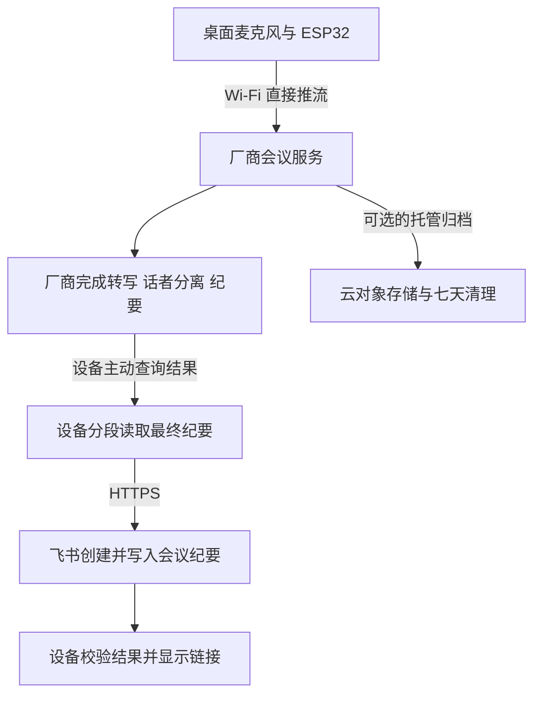

# 会议纪要：设备直连云服务与飞书，尽量减少自建云端

> 最新试验选择：同时验证「实时推流到听悟」和「流式上传到云端，会后交给飞书原生妙记」。两条都不在设备保存录音。价格、测试工具与当前阻塞见 [两条链路试验说明](../../tools/meeting_trial/README.md)。下文直连导出文档的路径对应 A 的后续扩展；B 使用飞书自己的转写和 AI 总结。

更新日期：2026-09-08。此方案按用户最新偏好，将“设备直连”作为默认方向。自建会议网关、云端 CLI Worker 都是可选扩展。当前状态为接口与架构评估，尚未完成固件直连实测。

**结论**

现有 ESP32-C3 不能直接运行电脑上的飞书 CLI 程序；固件可以通过 HTTPS 调用飞书开放 API，实现创建、写入和读取会议纪要文档。因此，自建云服务器不是生成飞书会议纪要的必需条件。

ESP-IDF 5.5.3 为 ESP32-C3 提供 HTTP/S 客户端及流式读写；飞书提供文档创建接口。这里的可行性结论来自协议能力，尚不代表现有板子的内存、鉴权和整场会议流程已验证通过。[ESP-IDF HTTP 客户端](https://docs.espressif.com/projects/esp-idf/en/v5.5.3/esp32c3/api-reference/protocols/esp_http_client.html)、[飞书创建文档](https://open.feishu.cn/document/server-docs/docs/docs/docx-v1/document/create)。

如果硬件是能够运行兼容 Linux 环境的设备，则可以评估直接安装 CLI；当前 MCU 平台应使用 C/C++ HTTP 客户端调用 API，无需仅为 CLI 更换硬件。

**默认链路：不部署自有计算服务**

音频采集只经过 RAM，不写设备 Flash。设备直接连接 STT／会议服务；会后主动轮询任务结果，不需要在公网暴露设备，也不要求自建回调服务器。最终纪要由设备分批写入飞书。

仍保留用户需要的云端 STT、说话人识别、AI 纪要和飞书服务。减少的是自己开发和运维的网关、数据库与常驻 Worker；托管对象存储是否需要，取决于七天重放测试和厂商留存能力。

**首版优先选一体化会议 API**

优先验证“设备直连通义听悟 → 会后取回纪要 → 飞书 API”。听悟公开接口支持实时音频、话者分离和会后摘要／待办，任务可以查询结果；其转码功能可将音频写入指定 OSS。适合减少跨服务搬运全文的工作。[听悟接口与实现](https://help.aliyun.com/zh/tingwu/interface-and-implementation)。

具体阶段是：创建会议任务、获取推流地址、实时上传、停止推流、关闭音频连接、结束任务、查询结果、读取纪要、创建飞书文档、分段写入、回读确认。采用主动查询，不要求启用回调。

一体化服务的匿名话者分离不等于知道具体姓名。首版可先用发言人 A／B 和人工姓名映射；如果必须依据注册声纹识别具体人员，另试讯飞等明确支持注册能力的接口，并保留未知人员状态。[讯飞实时转写与注册声纹参数](https://www.xfyun.cn/doc/spark/asr_llm/rtasr_llm.html)。

**现有 C3 的实现策略**

| 阶段 | 控制内存的方法 |
| --- | --- |
| 开会前 | 完成任务创建和必要鉴权后释放临时 HTTP 资源 |
| 录会中 | 以一条音频 WSS 为主要连接，固定 RAM 缓冲，减少 UI／BLE 资源占用 |
| 会议结束 | 先停止采样并关闭 WSS，再进行结果查询与飞书写入 |
| 读取纪要 | 流式解析或按块处理，不能把整场逐字稿和巨大 JSON 一次载入 RAM |
| 写飞书 | 先支持标题、段落和待办，限制每批字数与块数，明确记录成功范围 |
| 恢复 | 只保存任务 ID、文档 ID、导出进度等必要元数据，不保存音频 |

代码记录的空闲堆约 50–60 KB，尚未测量这条链路的峰值。优先测“连续采音＋Wi-Fi＋TLS”和“最终纪要分段写入”，再确定 C3 能支持的模式。若要求多厂商同时推流、保存规范原始音频、处理整场转写或复杂多麦前端，带 PSRAM 的硬件更值得评估。[当前硬件](D:/folotoy/folo-ai-passport-firmware-demo/README.md:25)。

断网超过 RAM 能力仍会丢失音频；这个边界与是否存在自建网关无关。设备掉电后，厂商已接收的任务可按接口规则查询；尚未上传的声音无法恢复。没有常驻执行器时，设备在会后处理与飞书导出期间需要保持开机；中途断电则下次联网继续处理可恢复的任务。

**飞书 API 与授权**

固件新增飞书输出适配器，负责获取／更新访问凭证、创建文档、按段落写内容、回读验证和返回链接；不运行 Shell，也不执行 `npx`。CLI 可保留给开发阶段验证接口和配置信息。

电脑上已经配置的 CLI 登录态不会自动出现在设备上。设备需要单独的授权和凭证管理。保持用户身份写入时，要实现对应的用户授权、令牌刷新与失效处理；不能只复制一个短期 access token 后承诺长期自动运行。

对于自用／企业内部样机，可评估每个使用方自行配置云服务凭证与飞书自建应用，采用最小权限并明确文档归属和目标目录访问权；应用身份创建不是用户身份创建，必须验证实际用户能打开文档。这里只评估这种部署方式，不自动切换现有 CLI 的用户身份，也不读取其登录缓存用于烧录。[飞书自建应用访问凭证](https://open.feishu.cn/document/server-docs/authentication-management/access-token/tenant_access_token_internal)。

开放固件中不能嵌入所有设备共用的应用密钥。用户自带凭证可作为自用模式；若希望面向多人分发且统一管理厂商账户，可选择一个仅负责鉴权／签名的按需函数，音频和纪要仍直接连接服务商。它是凭证管理的可选折中，不作为首版固定前提。

**七天录音与多厂商对比**

一体化服务如果能按要求归档并删除录音，可以由其托管存储承担七天重放。若必须使用同一份规范 PCM／无损音频评测全部厂商，则需要一份可控的云端原始音频副本。对象存储属于托管服务，不需要同时部署自有服务器。

听悟文档中的同步转码输出为 MP3，不能直接等同于本项目最初要求的无损对比母带。若改用它重复测试，应对所有厂商统一使用相同解码波形，并把测试类型明确标为 MP3 源；需要测原始采样质量时仍保留规范原始副本。[转码参数](https://help.aliyun.com/zh/tingwu/interface-and-implementation)。

C3 直接同时向 STT 和对象存储发送音频会增加连接和缓冲压力，尚未验证。试用阶段的批量对比可以由临时启动的测试电脑／任务执行器从云存储读取录音，不需要把它变成生产环境常驻网关；也无需下载录音到电脑磁盘。

厂商的内部留存与托管桶的清理分别核对，七天策略不能只写在设备配置里。飞书纪要作为用户要求导出的文本按飞书空间策略保存，原始录音默认不附加到飞书。

**开放固件怎么支持各家**

| 组件 | 设备直连版职责 |
| --- | --- |
| MeetingProvider | 创建／结束任务、推流、查询、读取云端结果 |
| SpeakerProvider | 可选注册声纹、人员映射、未知人员和资源删除 |
| SummaryProvider | 优先使用会议服务原生纪要；独立 LLM 作为额外模式 |
| FeishuExporter | 创建、分段写入、回读、去重、返回文档链接 |
| CredentialProvider | 用户配置、短期令牌／签名、刷新、清除和重绑 |
| BoardProfile | C3／S3 的引脚、内存与外设差异 |

各家适配器可以编译进固件并按配置选择，一场会先只启用一家音频服务。增加协议适配通常需要升级固件；已经接入的厂商之间切换、修改已支持模型和账号配置，不必重新烧录。接口不是同一套格式，不能用一个通用 URL 配置声称全部兼容。

12 家都保留在选型清单，但按直连难度分层验收：先做具有原生纪要的一体化服务；再做有 WSS 和完整结果查询的 STT；最后评估需要多服务转发全文、特殊流协议或复杂文件任务的组合。尚未实现和实测的适配器明确标为待接入。

**下一步验证顺序**

1. C3 直接发 HTTPS 请求并完成 TLS 资源释放，测最小堆和最大连续块。
2. 直接推五分钟 PCM 到首选会议服务，结束后主动取回短纪要。
3. 用专门授权的飞书身份直接创建文档、分段写入并回读，验证权限和中文。
4. 合并为真实会后自动导出流程，验证掉电恢复、导出去重和长会稳定性。
5. 逐家扩展适配器，单独验证实名声纹、七天录音重放和复杂多服务组合。

以上为设计与验证计划，本次未创建新的飞书文档、配置设备凭证或调用收费语音服务。
