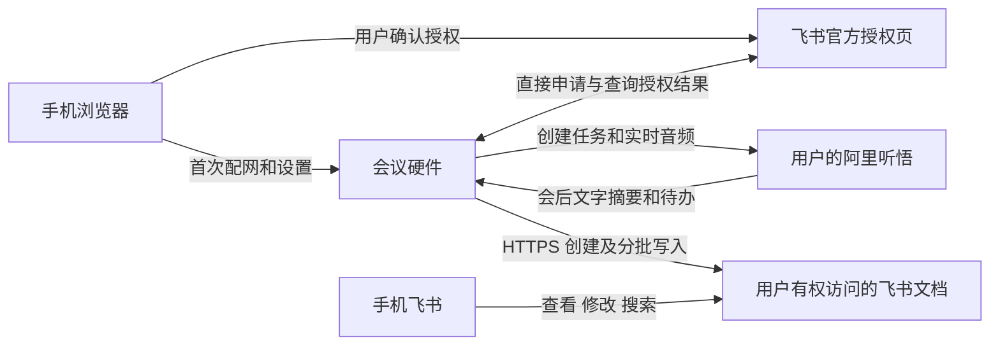

# 录音豆参考与会议设备直连飞书方案

最终已确认“Wi-Fi 独立录音、录音时关闭蓝牙、会后安卓编辑、直接调用飞书 API”，并已开始原型实测。最新实施方案见[安卓协作方案](2026-09-09-meeting-wifi-ble-companion.md)。本文保留竞品和接口研究，不作为当前固件验收记录。

核对日期：2026-09-09。本文区分资料证据、实现方案和待验证项；本轮没有烧录新固件、创建云任务或改变现有飞书授权。

## 结论

产品主路径：**一个会议硬件 + 一部手机，设备通过 Wi-Fi 直接调用用户自己的听悟和飞书账号**。手机负责配置、授权及查看结果，电脑、CLI、NAS 和厂商中转后台不进入日常使用链路。手机可提供 2.4 GHz 热点；使用办公室 Wi-Fi 时手机无需始终留在设备旁边。

先实现“听悟生成纪要 → 设备直接创建普通飞书在线文档”。原生飞书录音/妙记的硬件流式入口是另一条路线，本次没有找到足以承诺任意第三方设备可直接接入的公开协议。普通文档导出不能等同于录音豆的原生声纹、实时智能纪要与会员权益。

当前 ESP32-C3 已实测 Wi-Fi/WSS 直传听悟，ESP-IDF 提供 HTTPS 客户端；独立任务管理、飞书授权、文档写入及续期仍待固件开发与实测。[ESP-IDF HTTPS 客户端](https://docs.espressif.com/projects/esp-idf/en/v5.5.3/esp32c3/api-reference/protocols/esp_http_client.html)

## 录音豆的参考价值

飞书官方产品文章描述了按键录音、手机查看会中转写与 AI 总结、会后沉淀到飞书的流程。安克负责硬件，飞书提供软件和 AI 能力。[飞书官方产品介绍](https://www.feishu.cn/content/article/7597268954498763996)

安克说明书进一步明确：开始/结束有震动和灯光反馈；实时转写要求设备与手机保持连接；设备保存文件，连接手机后传输，完成才删除；默认蓝牙传输，Wi-Fi 快传要求手机加入设备热点。这是设备到手机的文件传输，不能据此认定录音豆独立连接路由器完成云端处理。[安克产品说明书，第 3、7、8 页](https://salesforce-knowledge-download.s3.us-west-2.amazonaws.com/000032845/en_US/000032845.pdf)

| 参考点 | 我们的落地方式 |
| --- | --- |
| 一键录音、反馈明确 | 保留实体键，真正开始采集后显示录音状态；明确区分连接、录音、处理及已写入飞书 |
| 手机展示内容 | 配置页提供状态、标题和历史链接；完整纪要在手机飞书中阅读、修改、搜索 |
| 会后自动归档 | 设备写入并回读飞书，默认标题为日期时间和会议主题 |
| 绑定与解绑 | 手机确认设备和账号，支持清除配置、解绑及重新授权 |
| 实际收音体验 | 桌面多人会议验证距离、噪声、轮流和同时发言；录音豆麦克风指标不作为本板性能结论 |

我们仍遵循音频不落设备/电脑本地的约束，不采用其先存文件、以后同步的方式。当前 RAM 音频队列约一秒；断网超出缓冲能力，无法补回未上传音频，应停止并标记不完整。使用手机热点时，手机离开或关闭热点会影响录音上传。

## 无自建中转的运行链路

无需我们部署音频接收、签名、任务调度或 CLI 中转服务。听悟和飞书仍提供云服务，费用和权限由用户自己的账号承担。

1. 首次配置：手机连接设备免密码 AP，设置路由器或手机热点；通过经过配对保护的入口设置用户云账号。
2. 绑定飞书：设备申请授权，展示官方链接或二维码；手机确认，设备直接查询结果。
3. 开会：按键触发设备创建听悟任务、实时上传。关闭配置页不会中止录音；手机提供热点时热点仍须开启。
4. 结束：停止采集、排空队列、结束听悟任务、查询纪要，然后直接写飞书。
5. 查看：屏幕显示完成和查看入口，手机飞书打开全文；失败时保留可恢复的导出状态。

手机自己的热点、手机访问热点下设备的能力、配置 AP 关闭后的设备发现，都须在 iOS/Android 实测。手机浏览器后台存活不是录音成功条件。

## 飞书授权：可参考官方 Device Flow

官方 CLI 源码包含 OAuth Device Flow：申请设备码，返回官方确认地址，用户在手机确认，客户端直接轮询 token 接口。这条实现不要求调用方部署公网 OAuth 回调服务器，但仍使用应用 ID/Secret。源码可以作为固件移植依据，不能替代目标应用与本板验证。[官方 Device Flow 源码](https://github.com/larksuite/cli/blob/7a6a4dbdf510689dd00e841ae79f6138e7f70cbe/internal/auth/device_flow.go)

| 环节 | 官方实现 | 固件工作 |
| --- | --- | --- |
| 申请授权 | `/oauth/v1/device_authorization` | 展示确认地址，遵守返回的有效期和轮询间隔 |
| 获取用户凭证 | `/open-apis/authen/v2/oauth/token` 的设备码模式 | 处理等待、拒绝、限流、过期，检查实际授权范围 |
| 续期 | 同一 token 接口的 refresh_token 模式 | 原子保存新凭证、掉电恢复，失效时要求重新授权 |
| 用户身份写文档 | 用户凭证调用文档接口 | 核对目录权限、归属，并由手机实际打开验证 |

端点依据：[官方路径定义](https://github.com/larksuite/cli/blob/7a6a4dbdf510689dd00e841ae79f6138e7f70cbe/internal/auth/paths.go)。续期依据：[官方用户凭证实现](https://github.com/larksuite/cli/blob/7a6a4dbdf510689dd00e841ae79f6138e7f70cbe/internal/auth/uat_client.go)。凭证期限以返回值为准，不承诺永久有效。

**应用配置与用户登录是两个环节。** 官方还有扫码创建 `PersonalAgent` 应用的流程，但页面及应用类型面向 CLI/个人代理。它能否适用于本开放硬件、各租户和手机独立开通，仍须验证，不能先作为量产保证。[官方应用注册源码](https://github.com/larksuite/cli/blob/7a6a4dbdf510689dd00e841ae79f6138e7f70cbe/internal/auth/app_registration.go)

原型先使用用户自己的适用应用验证。若扫码注册不适用，需要用户/企业管理员预先建立应用并配置权限。“日常仅需硬件和手机”和“首次开通无需技术配置”分别验收。出厂不内置厂商共享应用 Secret，不复制电脑 CLI token 到固件作为长期方案。

当前开放 AP 的 HTTP 页面只用于 Wi-Fi 配网，不能直接用于明文输入长期云密钥。云账号设置要补可信配对、受保护的传输与保存；网页令牌或加密函数本身不能保证 HTTP 页面免受替换。若手机浏览器能力不足，评估仅负责配置的轻量应用，仍无需音频/纪要中转后台。

## 普通文档与原生妙记

文档路径直接调用[创建文档](https://open.feishu.cn/document/server-docs/docs/docs/docx-v1/document/create)及[创建正文块](https://open.feishu.cn/document/server-docs/docs/docs/docx-v1/document-block/create)，写入听悟已生成的主题、摘要、待办和必要来源信息。固件实现相应 HTTPS 请求，不运行完整 CLI。

本次查到的官方 `minutes +upload` 要求已经上传到飞书云空间的完整音视频 `file_token`，再异步生成妙记。这不是实时 PCM/Opus 推流接口的证据；文件分片上传也不等于支持长度未知的持续录音流。[官方妙记上传说明](https://github.com/larksuite/cli/blob/7a6a4dbdf510689dd00e841ae79f6138e7f70cbe/skills/lark-meeting/references/lark-minutes-upload.md)

若以后取消听悟、全部使用飞书原生转写/声纹/纪要，应先向飞书核实第三方硬件接入的流式协议、鉴权、权益计费、手机 App 依赖及断流要求。当前证据不足以保证这条路线；本轮没有联系厂商或发送消息。

## 本板的实现重点

三分钟实测最低空闲堆 7,200 字节，完整上传 5,760,000 字节；24 小时仍只是可配置上限。[本地实测报告](../../tools/meeting_trial/RESULT-2026-09-09.md)

- 分阶段使用 TLS：创建任务后释放 HTTP 连接；录音阶段优先保留 WSS；结束后释放音频/WSS 资源，再查询纪要和写飞书。测量阶段切换后的当前空闲堆及最大连续内存。
- 有界解析、分批写正文，逐字稿按需读取，不在 RAM 同时保存整场文本和多份请求副本。
- 只持久保存少量任务 ID、文档 ID、标题、导出进度及必要配置；创建结果不明时先核对，避免重复文档，正文追加也须核对进度。
- 原音频继续不落本地，文字归档用户飞书。此前允许云端测试录音保留七天，仅在启用云端保存并配置生命周期的路径上执行，不宣称所有服务已自动七天删除。
- 屏幕以状态、计时、音量和查看入口为主，成功提示以飞书正文回读为准。

## 开发和验收顺序

1. 先验证设备直接申请飞书授权、手机确认、设备写入短文本并回读、手机打开；覆盖续期、掉电、撤销和目录权限。
2. 将电脑现有听悟创建/结束/查询逻辑移到设备，按键独立开始和结束，沿用已验证的音频推流。[听悟实时任务流程](https://help.aliyun.com/zh/tingwu/interface-and-implementation/)
3. 完善手机网络、用户云账号、飞书绑定、标题和时长页面，验收热点及凭证保护。
4. 按 30 分钟、1 小时、2 小时推进实测，覆盖长句、多人、弱网和中断；电脑关机后仍须完成录音到飞书结果的全过程。

CLI 保留为开发期检查工具及既有导出方式，不进入新产品主路径。当前试验仍需要电脑控制听悟任务；本文不表示独立运行已交付。
