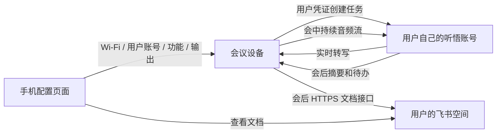

# 会议设备：用户自配云服务、独立运行与飞书输出

最终方案采用安卓版 App 蓝牙配网，录音时关闭蓝牙，会后获取并编辑最终文字，手机直接调用飞书 API。已开始实现与实测，以[安卓协作方案](2026-09-09-meeting-wifi-ble-companion.md)为准。以下手机网页方向保留为历史讨论。

本日补充：用户进一步明确以“一个硬件 + 手机、设备直接调用飞书、尽量无自建云服务”为主路径。最新竞品核对、无回调授权依据和开发顺序见[录音豆参考与设备直连飞书方案](2026-09-09-meeting-feishu-direct.md)。以下已有能力描述仍有效，CLI 只保留为开发工具和既有试验导出方式。

日期：2026-09-09。用户已选择：**手机网页配置，设备随后独立工作**。产品提供硬件和开放固件，使用者承担自己账号产生的 STT、摘要及可选存储费用。厂商不提供默认共享付费账号，不将测试账号、共享飞书应用密钥或统一扣费后台写入固件。

## 当前已实现与产品目标

| 能力 | 当前状态 | 独立设备目标 |
| --- | --- | --- |
| 手机 AP 配 Wi-Fi | 已实板验证免密码热点、自动弹页、保存及重启联网 | 保留，并提供重新配网及清除配置 |
| 录音时长 | 固件和电脑控制协议已从 5 分钟改为可设置 1 秒至 24 小时；默认试录仍为 60 秒 | 手机设置常用时长，按键开始/停止，显示剩余与已录时长 |
| 独立音频上传 | 已验证设备 Wi-Fi/WSS 直传三分钟，音频不经过电脑 | 继续优化长会议、连续长句及弱网；一场会启用一家音频服务 |
| 云任务控制 | 仍由电脑创建、结束和查询 | 由设备使用用户账号完成签名、鉴权、创建、结束和查询 |
| 用户自配云账号 | 当前是电脑显式加载用户 `.env`；固件不含长期云密钥 | 手机设置用户自己的云账号，设备安全保存、验证及清除 |
| 飞书在线文档 | 已实现电脑 CLI 导出摘要与待办，并自动回读；可以选择会后自动导出 | 设备会后用飞书 HTTPS API 直接导出，手机查看；日常不依赖 CLI 执行器 |
| 多厂商 | 当前只有听悟的设备推流适配完成 | 同一配置结构与适配器接口，逐家实现；不把更换 URL 当作兼容所有厂商 |
| 屏幕 | 已有录音状态、时长、音量、配网和纪要状态；新增小时格式 | 状态优先，短文字可选，完整逐字稿和纪要在手机/飞书查看 |

**手机云账号配置、设备独立云任务控制、设备直接写飞书目前尚未实现。现有 AP 页面只配置 Wi-Fi，不应将其描述成已完成全部产品设置。**

## 运行链路与费用归属

手机负责配置和查看，不能让手机浏览器保持后台运行来维持录音。页面关闭、手机离开、电脑关机后，目标版本仍应完成录音和会后处理。设备需要联网和供电；会后断电可以通过保存任务 ID、文档 ID 及导出进度恢复查询，不保存原始音频。

使用者在各云厂商开通服务，填写自己账号的凭证，录音与摘要费用直接计入该账号；没有配置时进入“待配置”，不回退到厂商测试账号。将“用户自带账号”与“服务免费”明确区分，免费额度是否可用由对应账号决定。

## 手机配置页面

| 页面 | 第一版字段与行为 |
| --- | --- |
| 网络 | 扫描/手动添加 2.4 GHz Wi-Fi、验证连接、保存、重新配网 |
| 语音服务 | 厂商、区域、AppKey、用户专用凭证；显示配置状态、连接验证结果、清除/更换。未实现厂商显示“待接入”，不能选择后静默调用听悟 |
| 会议 | 默认时长、语言、话者分离开关、摘要和待办开关；默认按日期时间和会议主题命名，可手动设置本次标题；可选服务功能由适配器声明 |
| 飞书 | 输出方式、用户自己的应用/授权、目标目录或有访问权的空间、验证输出、自动导出开关 |
| 记录 | 已结束会议的主题、时间、完整性、云端处理状态、飞书链接、重试导出；不显示密钥和签名 URL |
| 设备 | 固件版本、已实测时长、设备端时长上限、重绑/清除云配置；普通操作不修改设备身份 |

当前开放 AP 的 HTTP 配网页不能直接作为长期云密钥的安全输入通道。热点仍可保持免密码；云账号配置另做设备身份校验、配对和加密通道，保存时使用受保护的凭证存储。纯手机网页的设备信任与浏览器兼容性必须实测，不能仅因使用页面令牌就宣称密钥传输已加密。不会在这轮试验中烧写不可逆的安全熔丝。

网页、固件和控制协议应共同开源，凭证只保存于使用者授权的位置。预置的是接口地址、协议和公开能力描述，不是任何共享付费凭证。自用模式可支持用户专用 RAM 凭证；不要求所有购买者共用一套主账号。

## 时长

五分钟是试验代码限制，已经修改；听悟官方单次记录上限为 24 小时。配置上限不代表硬件已经通过同等时长验收，完整实测仍为三分钟。正常结束仍要求采集与发送字节数一致；长时间录音不会把完整音频积压到设备 Flash。

手机可设计 15/30/60/120 分钟及自定义，单次仍受所选厂商上限约束。实体键随时结束。显示超过一小时切换为 `HH:MM:SS`，避免显示成难读的累计分钟。达到上限应明确收尾，不能静默重建任务后把多场会当作一场。

长会验收按 30 分钟、1 小时、2 小时推进，同时覆盖持续讲话、多人轮流、网络抖动和手动停止。当前 PCM 队列仅约一秒；长测失败应优化音频编码/内存及断流策略，不能通过只修改时长数字宣称产品已稳定。

## 飞书输出

当前电脑路径：听悟完成 → 读取文字摘要/待办 → 本地 Markdown → `docs +create --api-version v2 --as user` → `docs +fetch` 校验正文 → 返回在线文档链接。录音不上传到飞书。此路径生成普通飞书在线文档，不创建飞书原生妙记。

已完成的样例：[2026-09-09｜会议录音测试（3分钟）](https://huitong-tech.feishu.cn/docx/Ncz0dBpYHoKPpZxbHGnc4ykZnyd)。它来自三分钟现场随意对话的云端结果，仅用于验证导出链路。已原地改名并回读确认，正文及链接保留。

电脑脚本已支持自动命名 `日期时间｜会议主题`，或首次发布前以 `--title` 指定完整标题。新录音保存开始回执时间；历史任务缺少录音时间时明确标注“导出”时间。已创建的文档允许用户在飞书改名，重复导出不覆盖后续改名。手机上的标题设置入口属于后续页面工作。

新增 `export_feishu.py`：保存创建状态与文档 URL；创建请求结果不确定时停止重试，避免重复文档；已创建后重试只做回读。只导出摘要和待办，厂商文字按字面转义，拒绝检测到的凭证，回读同时检查任务 ID 和实际摘要。会后自动导出由电脑脚本的 `--feishu` 显式开启。

设备独立路径：当前 C3 不运行 CLI，改由固件使用飞书 HTTPS API 创建和分批写入文档。电脑 CLI 的用户登录态不会自动成为设备登录态，设备必须有独立授权、续期、撤销及文档归属处理。自用/企业场景可以配置使用者自己的飞书自建应用，并验证目标使用者有权访问；不能将应用身份文档假称为用户身份文档。

CLI 保留用于开发验证和当前试验导出，新产品日常链路由设备直接调用飞书，不要求用户部署电脑、NAS 或服务器执行器。当前没有指定群聊或收件人，因此没有群发或私信；生成文档和发送给他人分别配置。

## 屏幕显示

当前版本三分钟实测最低空闲堆为 7,200 字节。完整纪要或逐字稿持续增长，反复排版会增加分配、绘制及网络压力，不适合在现有 C3 上作为主界面。

| 状态 | 屏幕建议 | 刷新策略 |
| --- | --- | --- |
| 待机 | 已联网、服务配置状态、按键开始、默认时长 | 状态变化时更新 |
| 录音 | 明确红色录音指示、时长、音量、上传状态、停止操作 | 时长 1 Hz，音量 5 Hz，状态变化时更新 |
| 可选字幕 | 最近一条最终转写，最多两行，固定缓冲约 256–512 字节，不保存历史 | 最多 1 Hz，仅内容变化时更新 |
| 结束处理中 | 录音已停止、上传完成/不完整、纪要生成中、飞书导出中 | 仅阶段变化时更新 |
| 完成 | 主题短标题、已导出/待导出，查看入口或二维码 | 静态显示；二维码放在会后，单独验证内存与可扫描性 |
| 异常 | 明确已停止、录音是否不完整、可执行的重试/配网操作 | 仅状态变化时更新 |

会中的文字应标为“实时转写”，不是“实时纪要”。当前听悟任务结束后才进入纪要生成阶段。若另做周期性 AI 要点，则会增加模型调用、费用和连接占用，应作为用户明确开启的独立能力；本轮未启用。

完整逐字稿和最终纪要放在手机/飞书查看。已有中文字体并不覆盖所有汉字、英文标点及 emoji，任意转写上屏前还需验证缺字、UTF-8 截断、两行长度和长词布局，不能简单把完整字符串塞进 LVGL 标签。

## 实施顺序与验收

1. 已完成本轮代码：解除五分钟限制、设备上限协商、小时格式、飞书 CLI 文字导出与回读；36 项 Python 测试通过，试验固件构建和应用烧录通过。重启联网后回读上限为 86,400 秒，130 项板内解析检查通过。配置 24 小时仅是协议能力，不是耐久实测。
2. 下一阶段：定义并实现手机服务配置与受保护的凭证存储；设备完成用户账号鉴权、按键开始、独立创建/结束任务和会后查询。验收时必须关闭电脑和手机页面仍能工作。
3. 随后：设备直连飞书、授权过期和导出去重/恢复、会后查看入口；验收文档归属与用户实际访问权限。
4. 在以上链路稳定后加入短字幕和其他厂商适配，同时做长会/弱网及电池续航测试。

## 依据

- [听悟实时任务接口与上限](https://help.aliyun.com/zh/tingwu/interface-and-implementation/)
- [ESP32-C3 HTTPS 与流式 HTTP 客户端](https://docs.espressif.com/projects/esp-idf/en/v5.5.3/esp32c3/api-reference/protocols/esp_http_client.html)
- [飞书创建在线文档 API](https://open.feishu.cn/document/server-docs/docs/docs/docx-v1/document/create)
- 飞书 CLI 能力已用本机 `@larksuite/cli@latest` 帮助、Markdown 参考及实际创建/回读核对。
