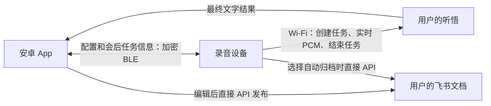

# Wi-Fi 录音与安卓蓝牙协作

更新：2026-09-09，已进入原型实施。本文件取代此前“会中蓝牙常驻、实时编辑、手机嵌入 CLI”的讨论稿。

同日新增：手机已有独立的讯飞声纹试验入口，可录制 5 秒声音，明确上传后注册或识别，并可删除声纹。需要另领讯飞免费包；会议转写仍用听悟，本场姓名编辑流程保持原有行为，尚未把声纹结果自动关联到会议发言人。配置、操作与验证见 [Android 使用说明](../../companion/android/README.md#手机声纹试验) 和 [声纹试验记录](../../tools/meeting_trial/RESULT-VOICEPRINT-2026-09-09.md)。

## 用户确认的流程

1. 安卓 App 通过蓝牙配网、配置用户自己的听悟和飞书账号。手机保持原有 Wi-Fi 或移动网络，不连接设备热点。
2. 设备通过 Wi-Fi 创建听悟任务、采集并实时上传 PCM。录音期间关闭蓝牙；屏幕显示状态、计时和音量，不显示整篇文字。
3. 结束录音后，设备关闭音频通道并结束听悟任务。云端收尾先使用释放的 RAM，随后重新开启蓝牙。
4. 手机同步任务编号，直接从听悟下载最终摘要、待办和逐字稿。原稿与编辑稿分别保存，重新查询不覆盖用户修改。
5. 手机直接调用飞书 API 发布编辑稿。设备独立归档为另一种录前选择的模式。

没有厂商中转服务。音频不保存到设备、手机或电脑；设备仅保留有界 RAM 音频队列。文字、任务信息和配置可以持久保存。当前直连听悟没有自建云音频副本，也没有实现跨云七天自动删除；此前允许云端保留七天不等于该策略已经实现。

## 配置与界面

采用原生 Java 安卓 App，最低 Android 8，入口为手机桌面的“Folo 会议”，包含“设备 / 记录 / 服务设置”。不要求 Termux、Node 或 CLI。

BLE 使用 LE Secure Connections、加密且经过认证的 GATT 读写。首次配对在手机系统弹窗输入设备屏幕上的六位码。开机或长按设备上键开启配对窗口，普通重连使用已保存的配对关系。当前只支持一个已绑定手机。

Wi-Fi 验证成功才保存，失败恢复原配置。账号、录音上限和默认标题由用户填写。蓝牙只传配置和任务元数据，不传音频或整篇纪要。

手机使用 Android Keystore 与 AES-GCM 保存资料，不参加系统备份。开发板当前使用普通 NVS，尚未开启 Flash 加密或安全启动；本次没有修改相关 eFuse。此限制需在产品化前解决。

## 录音与内存

输入为 16 kHz、16 bit、单声道 PCM，每 20 ms 一帧。50 帧队列约 32 KB，容纳一秒网络抖动。网络无法及时发送时终止并标记不完整，不向 Flash 写音频补录。

本版在 TLS 建连前预留音频队列，启用 TLS 动态收发缓冲，保留 16 KB 最大入站记录兼容性。WebSocket 传输缓冲为 1 KB，屏幕使用 8 行绘制缓冲，录音时不向 USB 输出实时全文。蓝牙主机完成初始化后才允许关闭，云端收尾与蓝牙尽量分时运行。

服务与固件参数上限为 24 小时，App 默认两小时，测试设备暂设一分钟。参数上限不代表硬件已通过长录和电池续航验收。

## 会后编辑与飞书

每场记录用听悟 TaskId 关联原稿、用户标题、摘要、待办、逐字稿和飞书文档编号。设备保存当前会议及最近八场元数据，手机保留已同步记录。修改逐字稿不会自动重跑摘要。

| 录前模式 | 行为 |
| --- | --- |
| 手机确认后发布 | 设备完成听悟任务，手机获取结果、编辑并发布 |
| 设备自动归档 | 设备获取结果并直接写飞书，手机随后编辑已知文档 |

手机发布默认包含会议信息、纪要与待办、完整逐字稿，采用飞书章节标题、列表、引用和加粗发言人排版。发布前提供原生滚动预览。逐字稿使用手机编辑稿；与原稿对应时附带时间段，修改正文后不强行附加旧时间。

首次创建前保存意图，收到文档编号立即持久化，写入后回读验证。创建结果不明确时不自动另建一份。多块更新使用加密操作日志、修订号检查和分批写入，先验证新正文再移除旧块；中断重试可以恢复同一次更新。更新中短暂存在新旧内容并存，检测到远端修改时停止供用户核对。带评论、嵌套或附件的复杂文档交给飞书编辑。

当前手机导出限制为纪要 5 万字符、逐字稿 50 万字符、5000 个块；分页与每批 50 块避免单次请求过大。限制外明确报错，不截断。硬件自动归档仍只处理有界摘要和待办，本轮没有把整篇逐字稿载入 ESP32 RAM。

手机和硬件分别授权，不共用会轮换的 refresh token。开发机 CLI 登录不会自动变成手机授权。App 产品使用 API；开发机核对飞书文档时仍遵循用户的 CLI 偏好。

手机飞书授权、创建、修改标题更新同一文档和回读已在真机通过。硬件独立归档已有原型代码，尚需单独授权和实际验收。

## 发言人与声纹

当前启用听悟说话人分离，返回发言人编号，可在手机给本场发言人改名。这不是识别某个人的身份。[听悟 FAQ](https://help.aliyun.com/zh/tingwu/faq-about-basic-usage)

“提前注册小王，下次自动识别”工程量中等，是后续独立能力：注册和删除声纹、提取多人会议的有效片段、识别置信度、未知说话人和重叠讲话处理。讯飞提供注册和 1:N 检索 API，可作为候选，但尚未接入本版。[讯飞声纹 API](https://www.xfyun.cn/doc/voiceservice/isv/API.html)

## 验收

实际数值见 `tools/meeting_trial/RESULT-COMPANION-2026-09-09.md`；构建使用见 `companion/android/README.md`。蓝牙配网、手机最终纪要、编辑保留、飞书授权与发布、断电恢复及长录续航需要分别验证。
